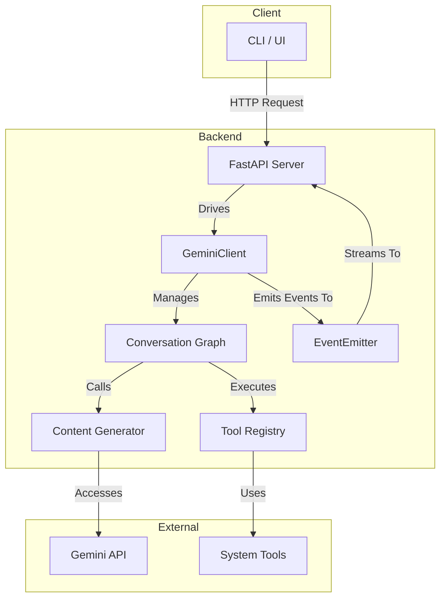

# Architecture Overview

This document provides a high-level overview of the `gemini-cli-core` backend architecture. Understanding how the key components interact is crucial for development and troubleshooting.

## Architecture Diagram

The following diagram illustrates the flow of a user request through the system:

## Core Components

### 1. FastAPI Server (`server.py`)
- **Role**: The main entry point for all client communication.
- **Responsibilities**:
    - Exposes HTTP endpoints for session management (`/session/start`, `/session/end`), chat (`/chat`), and other interactions.
    - Handles incoming requests, validates them using Pydantic models, and passes them to the `GeminiClient`.
    - Manages the Server-Sent Events (SSE) connection to stream real-time responses back to the client.

### 2. GeminiClient (`core/app.py`)
- **Role**: The central orchestrator or "brain" of the application.
- **Responsibilities**:
    - Manages the lifecycle of a conversation session.
    - Initializes and holds instances of all other core components (the graph, tool registry, etc.).
    - Receives requests from the FastAPI server and invokes the `Conversation Graph` to process them.
    - Listens for events from the `EventEmitter` and forwards them to the client via the SSE stream.

### 3. Conversation Graph (`core/graphs/conversation_graph.py`)
- **Role**: The heart of the agent's logic, implemented as a state machine using LangGraph.
- **Responsibilities**:
    - Defines the step-by-step flow of a conversation (e.g., process input -> call model -> execute tools -> check for continuation).
    - Manages the `ConversationState`, which holds the history, user input, and tool calls.
    - Decides whether to call the language model, execute a tool, or end the turn.
    - For a detailed breakdown, see [Deep Dive: The Conversation Graph](./deep-dive-conversation-graph.md).

### 4. Tool Registry & Tools (`tools/`)
- **Role**: Manages and executes all available tools for the agent.
- **Responsibilities**:
    - The `ToolRegistry` holds a collection of all registered tools.
    - Each `Tool` is a self-contained class that performs a specific action (e.g., read a file, run a command).
    - The `Conversation Graph` invokes the `ToolRegistry` when the model requests a tool call.

### 5. EventEmitter (`core/events.py`)
- **Role**: A pub/sub system for internal event communication.
- **Responsibilities**:
    - Allows different parts of the system (especially the graph nodes) to emit events without being directly coupled to the `GeminiClient` or the client connection.
    - Events can represent model thoughts, tool calls, errors, or other significant state changes.
    - The `GeminiClient` subscribes to these events to provide real-time feedback.
