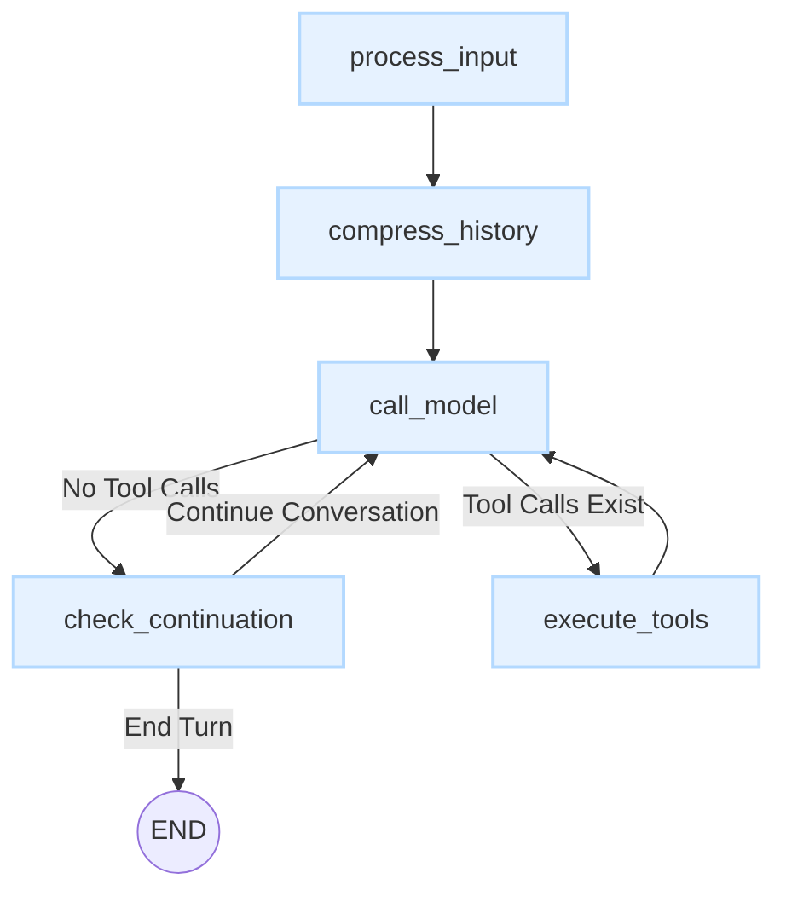

# Deep Dive: The Conversation Graph

The core of the `gemini-cli-core` agent's intelligence lies in its **Conversation Graph**. This is a state machine built with [LangGraph](https://python.langchain.com/v0.2/docs/langgraph/) that defines the entire lifecycle of a conversation turn. It dictates whether the agent should think, call a tool, respond to the user, or wait for more input.

This document breaks down how the graph works, its state, and each of its nodes.

## The State: `ConversationState`

The graph is stateful. At every step, a `ConversationState` object (`TypedDict`) is passed from node to node. This object contains all the information needed to process the conversation.

Key fields in `ConversationState` (`core/graphs/states.py`) include:
- `curated_history`: The chat history that is sent to the model.
- `comprehensive_history`: The complete, unabridged history, including all tool calls and system messages.
- `current_user_input`: The latest message from the user.
- `pending_tool_calls`: A list of tools the model has decided to call.
- `continue_conversation`: A boolean flag that determines if the agent should continue the conversation or hand control back to the user.

## Graph Flow

The conversation follows a well-defined path through the graph's nodes.

### Nodes and Their Responsibilities

Each node in the graph is a Python function that receives the current state and returns a dictionary to update the state.

1.  **`process_input` (Entry Point)**
    - **Purpose**: To prepare the user's message for processing.
    - **Function**: Takes the raw user input from the state, formats it, and adds it to the conversation history.

2.  **`compress_history`**
    - **Purpose**: To prevent exceeding the model's context window limit.
    - **Function**:
        - It checks the token count of the `curated_history`.
        - If the count exceeds a certain threshold (e.g., 95% of the model's limit), it calls the model to summarize the conversation.
        - The summary then replaces the old history, effectively "compressing" it while preserving context.
        - If no compression is needed, it passes the state through unchanged.

3.  **`call_model`**
    - **Purpose**: To get a response from the Gemini language model.
    - **Function**:
        - It takes the `curated_history` and sends it to the Gemini API.
        - The model's response can be a direct text answer or a request to use one or more tools.
        - It updates the state with the model's response and any `pending_tool_calls`.

4.  **`execute_tools`**
    - **Purpose**: To run the tools requested by the model.
    - **Function**:
        - This node runs a **subgraph** dedicated to tool execution.
        - It handles the entire lifecycle of a tool call: checking for user approval, executing the tool, and handling errors.
        - The results from the tool execution (e.g., file content, command output) are then added to the history as a special "function" role message.
        - The state is then passed back to the `call_model` node, so the agent can process the tool's output.

5.  **`check_continuation`**
    - **Purpose**: To decide if the agent should speak again or if the turn is over.
    - **Function**:
        - This node analyzes the last model response to see if it implies a follow-up action or question.
        - It sets the `continue_conversation` flag in the state.
        - **If `True`**: The graph loops back to `call_model` for another turn.
        - **If `False`**: The graph execution finishes for this turn (reaches the `END` node).

This cyclical and conditional flow allows the agent to handle complex, multi-step tasks that may involve several rounds of thought and tool use before providing a final answer to the user.
