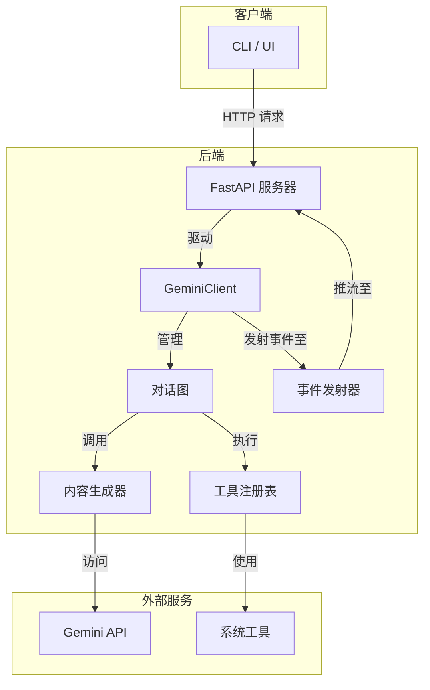

# 架构概览

本文档宏观地概述了 `gemini-cli-core` 后端的架构。理解各个关键组件的交互方式对于开发和问题排查至关重要。

## 架构图

下图展示了一个用户请求在系统中的完整处理流程：

## 核心组件

### 1. FastAPI 服务器 (`server.py`)
- **角色**: 所有客户端通信的主入口。
- **职责**:
    - 暴露用于会话管理 (`/session/start`, `/session/end`)、聊天 (`/chat`) 及其他交互的 HTTP 端点。
    - 处理传入的请求，使用 Pydantic 模型进行验证，并将其传递给 `GeminiClient`。
    - 管理服务器发送事件（SSE）连接，将实时响应流式传输回客户端。

### 2. GeminiClient (`core/app.py`)
- **角色**: 应用的中央协调器，即"大脑"。
- **职责**:
    - 管理对话会话的生命周期。
    - 初始化并持有所有其他核心组件的实例（如图、工具注册表等）。
    - 从 FastAPI 服务器接收请求，并调用 `对话图` 进行处理。
    - 监听来自 `事件发射器` 的事件，并通过 SSE 流将其转发给客户端。

### 3. 对话图 (`core/graphs/conversation_graph.py`)
- **角色**: 代理逻辑的核心，使用 LangGraph 实现的状态机。
- **职责**:
    - 定义对话的逐步流程（例如，处理输入 -> 调用模型 -> 执行工具 -> 检查是否继续）。
    - 管理 `ConversationState`，其中包含历史记录、用户输入和工具调用。
    - 决定是调用语言模型、执行工具，还是结束回合。
    - 更详细的分解，请参见 [深度解析：对话图](./deep-dive-conversation-graph.md)。

### 4. 工具注册表与工具 (`tools/`)
- **角色**: 管理和执行所有可供代理使用的工具。
- **职责**:
    - `ToolRegistry` 持有所有已注册工具的集合。
    - 每个 `Tool` 是一个执行特定操作（如读取文件、运行命令）的独立类。
    - 当模型请求进行工具调用时，`对话图` 会调用 `ToolRegistry`。

### 5. 事件发射器 (`core/events.py`)
- **角色**: 用于内部事件通信的发布/订阅系统。
- **职责**:
    - 允许系统的不同部分（特别是图节点）发射事件，而无需与 `GeminiClient` 或客户端连接直接耦合。
    - 事件可以代表模型的思考、工具调用、错误或其他重要的状态变化。
    - `GeminiClient` 订阅这些事件以提供实时反馈。 