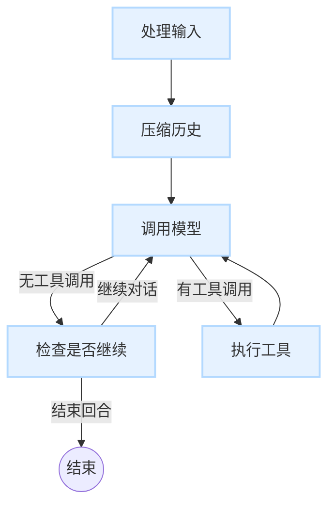

# 深度解析：对话图

`gemini-cli-core` 代理智能的核心在于其**对话图（Conversation Graph）**。这是一个使用 [LangGraph](https://python.langchain.com/v0.2/docs/langgraph/) 构建的状态机，它定义了对话回合的整个生命周期。它决定了代理应该思考、调用工具、回应用户，还是等待更多输入。

本文档将详细解析该图的工作原理、其状态以及每个节点的功能。

## 状态：`ConversationState`

该图是有状态的。在每一步中，一个 `ConversationState` 对象（`TypedDict`）会从一个节点传递到下一个节点。此对象包含处理对话所需的所有信息。

`ConversationState` (`core/graphs/states.py`) 中的关键字段包括：
- `curated_history`: 发送给模型的聊天历史记录。
- `comprehensive_history`: 完整、未经删节的历史记录，包括所有工具调用和系统消息。
- `current_user_input`: 来自用户的最新消息。
- `pending_tool_calls`: 模型决定调用的工具列表。
- `continue_conversation`: 一个布尔标志，用于确定代理是应该继续对话，还是将控制权交还给用户。

## 图流程

对话通过图的节点遵循一条明确定义的路径。

### 节点及其职责

图中的每个节点都是一个 Python 函数，它接收当前状态并返回一个字典来更新状态。

1.  **`process_input` (入口点)**
    - **目的**: 准备要处理的用户消息。
    - **功能**: 获取状态中的原始用户输入，对其进行格式化，并将其添加到对话历史中。

2.  **`compress_history` (压缩历史)**
    - **目的**: 防止超出模型的上下文窗口限制。
    - **功能**:
        - 检查 `curated_history` 的 Token 数量。
        - 如果数量超过某个阈值（例如，模型限制的 95%），它会调用模型来总结对话。
        - 该摘要随后会替换旧的历史记录，从而在保留上下文的同时有效地"压缩"它。
        - 如果不需要压缩，它会将状态原样传递。

3.  **`call_model` (调用模型)**
    - **目的**: 从 Gemini 语言模型获取响应。
    - **功能**:
        - 获取 `curated_history` 并将其发送到 Gemini API。
        - 模型的响应可以是直接的文本答案，也可以是使用一个或多个工具的请求。
        - 它会用模型的响应和任何 `pending_tool_calls` 来更新状态。

4.  **`execute_tools` (执行工具)**
    - **目的**: 运行模型请求的工具。
    - **功能**:
        - 此节点运行一个专门用于工具执行的**子图**。
        - 它处理工具调用的整个生命周期：检查用户批准、执行工具和处理错误。
        - 工具执行的结果（例如，文件内容、命令输出）随后会作为特殊的"函数"角色消息添加到历史记录中。
        - 然后状态被传回 `call_model` 节点，以便代理可以处理工具的输出。

5.  **`check_continuation` (检查是否继续)**
    - **目的**: 决定代理是应该再次发言，还是回合已经结束。
    - **功能**:
        - 此节点分析最新的模型响应，以判断其是否暗示了后续行动或问题。
        - 它在状态中设置 `continue_conversation` 标志。
        - **如果为 `True`**: 图会循环回到 `call_model` 进行下一轮。
        - **如果为 `False`**: 此回合的图执行结束（到达 `END` 节点）。

这种循环和条件流使得代理能够处理复杂的、多步骤的任务，这些任务可能涉及多轮的思考和工具使用，然后才向用户提供最终答案。 